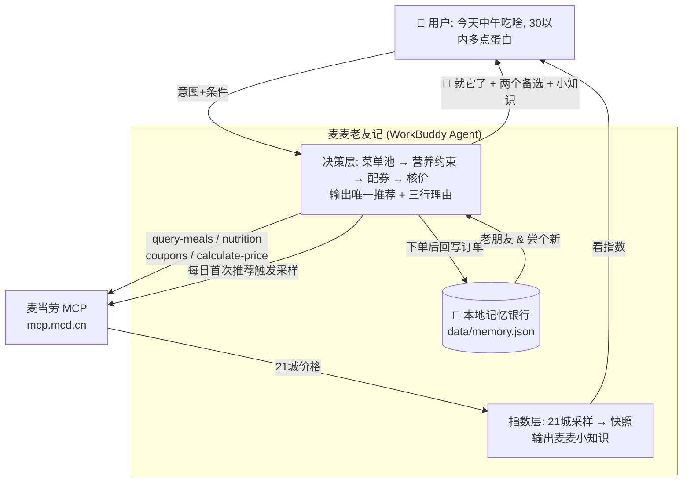

# 🍔 麦麦老友记 McMates

**只给一个答案的麦当劳点餐 Skill**——它记得你点过的每一单，也顺带告诉你今天全国的巨无霸卖多少钱。


## 项目介绍

"中午吃什么"，大概是当代人每天要做的最累的决定。麦当劳的菜单上一百多种商品，再加上会员券、随心配、限时活动——选择越多，下单越慢。等终于选好了，午饭时间也过去了一半。

麦麦老友记换了个思路：**你不用挑，老友替你挑。** 你只要说一句"今天中午吃啥，三十以内，多点蛋白"，它就回你一个答案——为什么是它、营养达没达标、券后多少钱，三行说清。下面再补两个备选：一个是你点过很多次、上次还给过五星的"老朋友"；一个是顺着你的口味、但你还没吃过的新品。它凭什么这么懂你？因为你在这里点过的每一单，它都记着。官方接口只能查到最近 10 单历史，老友记把这些订单存进你电脑本地的记忆银行，越用越懂你，越用越离不开。

每次推荐的最后，还会附赠一条"麦麦小知识"。《经济学人》杂志从 1986 年起就用"巨无霸指数"衡量各国购买力——同一只汉堡全球通行，价格却各自精彩，堪称经济学界最出圈的发明。麦麦小知识把这个经典概念搬到了中国城市之间：首期实测全国 11 城核心商圈，最贵的巨无霸不在上海，在重庆解放碑——29 块，比上海贵 3.5 块；北上广深反而齐刷刷站在便宜档。这个每天都在生长的价格档案，让你对自己花的每一块钱心里有数。

它解决三件事：**把"选不出来"变成"一个答案"；把"用完即弃"变成"越用越懂你"；把"稀里糊涂花钱"变成"明明白白消费"。** 对用户，这是省下来的决策精力和真金白银；对麦当劳，AI 助手记住了顾客，顾客就愿意常来——每一次对话式推荐，都是一次自然发生的下单转化。

## 三层能力

**① 就它了 —— 唯一推荐**
> "今天中午吃啥，30 以内，多点蛋白"
> → 双吉士汉堡 + 麦辣鸡翅 2 块 + 鲜煮咖啡：蛋白 38g，券后 26.8 元，附三行理由。不满意？往下看。

**② 老朋友 & 尝个新 —— 两个备选，来自你的记忆**
> · 老朋友：板烧鸡腿堡中套餐——你本月第 4 次点它，上次你给了五星
> · 尝个新：安格斯厚牛培根堡——在你最爱的牛肉簇里，你还没吃过

**③ 麦麦小知识 —— 每日一条，顺便看看全国行情**
> 📊 《经济学人》1986 年发明了巨无霸指数来衡量各国购买力。我们把它搬进中国城市：首期实测 11 城，最贵的是重庆解放碑（29 元），不是上海。说"看指数"查完整榜单。

## 架构



**一次对话，三个时间维度各司其职**：决策层处理"现在"，记忆层沉淀"过去"，指数层给出"宏观"。官方 10 个 MCP 工具的完整编排见 [MCP_INTEGRATION.md](MCP_INTEGRATION.md)。

<details>
<summary>📊 首期麦麦巨无霸指数（2026-10-09 深夜实测 11 城）</summary>

| 城市 | 巨无霸 | 中薯 | 合计 |
|---|---|---|---|
| 重庆（解放碑） | **29.0** | 14.5 | 43.5 |
| 成都（春熙路） | 26.5 | 14.5 | 41.0 |
| 西安（钟楼） | 26.5 | 14.5 | 41.0 |
| 哈尔滨（中央大街） | 26.5 | 14.5 | 41.0 |
| 郑州（二七商圈） | 26.5 | 14.5 | 41.0 |
| 武汉（江汉路） | 26.5 | 14.0 | 40.5 |
| 北京（三里屯） | 26.0 | 14.5 | 40.5 |
| 上海（人民广场） | 25.5 | 13.5 | 39.0 |
| 广州（天河） | 25.5 | 13.5 | 39.0 |
| 深圳（罗湖口岸） | 25.5 | 13.5 | 39.0 |
| 长沙（五一广场） | 25.5 | 13.5 | 39.0 |

三个反直觉发现：① 最贵的是重庆，不是北上广深；② 一线城市反而全军在便宜档；③ 同档城市价格完全一致（沪穗深长四城分毫不差）——麦当劳中国按城市档位分区定价的痕迹非常清晰。
</details>

## 三个设计原则

1. **只给一个答案**。选择本身就是成本，决策疲劳留给别人，省心留给你。
2. **记忆是资产**。官方接口只能查最近 10 单历史，老友记把你的每一次点餐存进本地记忆银行——订单、偏好、口味簇，越用越懂你。
3. **价格是知识**。每天采样全国门店真实价格（巨无霸指数），你会知道你所在的城市在全国排第几贵、什么时候买最划算。

## 快速开始

**前置条件**：麦当劳中国大陆会员（手机号在 [open.mcd.cn/mcp](https://open.mcd.cn/mcp) 申请 MCP Token）+ 任意支持 MCP 的 AI 客户端（WorkBuddy / Cherry Studio / Cursor 等）

1. 配置 MCP（Token 替换后填入客户端）：
```json
{
  "mcpServers": {
    "mcd-mcp": {
      "type": "streamablehttp",
      "url": "https://mcp.mcd.cn",
      "headers": { "Authorization": "Bearer YOUR_MCP_TOKEN" }
    }
  }
}
```
2. 把本仓库放入你的 AI 客户端工作目录，加载 [SKILL.md](SKILL.md)
3. 对它说第一句话："今天中午吃啥"

## 目标用户

- 每天为"吃什么"内耗的上班族和学生
- 想省钱但懒得研究优惠券规则的人
- 觉得"被记住偏好"是种温柔而不是冒犯的麦当劳常客

## 隐私与安全

- 记忆库只存本地（`data/memory.json`），不上传、不联网
- 领券、下单等写操作前必须经你逐项确认，绝不静默执行
- 指数采样只用只读接口，不触碰账户资产

## 技术栈

- 麦当劳官方 MCP Server（`https://mcp.mcd.cn`），10 个工具的三层编排：详见 [MCP_INTEGRATION.md](MCP_INTEGRATION.md)
- WorkBuddy（开发与运行环境）

## 参赛信息

- 赛事：[麦当劳程序员创意开发大赛](https://github.com/M-China/mcd-developer-innovation-challenge)
- 赛期：2026-10-09 ~ 2026-10-25

## License

[MIT](LICENSE)
